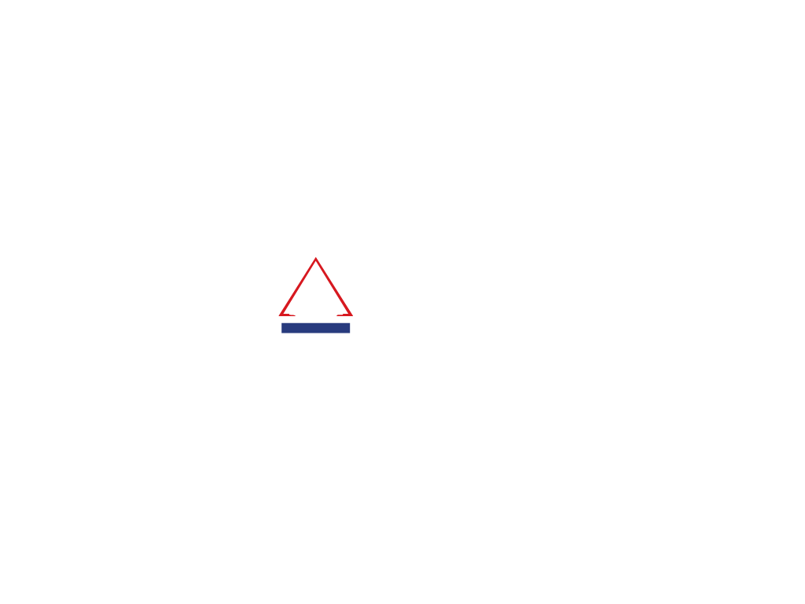

## _nology team project 
`Texas-Triangle`

### Welcome
- Hi and Welcome to the Texas Triangle. This project was created as our final project with _nology and is intended to help users learn more about the main areas that are inside of Texas that make a triangle. Those areas include different major cities within Texas such as Houston, Dallas-Fort Worth, Austin, and San Antonio.

## Table of Contents
1. [Technologies](#technologies)
2. [Installation](#installation)
3. [Collaboration](#collaboration)

## Technologies
***
A list of technologies used within the project:
* [React.js](https://example.com): Used to create the front-end of the project 
* [Jenkins](https://example.com): V
* [Terraform](https://example.com): V 
* [MongoDB](https://example.com): V
* [Vagrant](https://example.com): V
* [Ansible](https://example.com): V 
* [AWS](https://example.com): V
* [Application Testing](https://example.com): V


## Installation
***
A little intro about the installation. 
1. Clone the repo.
2. cd into the folder.
3. Install the dependencies
4. Start the react app

```
$ git clone https://github.com/jessebubble/nology-team-project.git
$ cd ../texas-triangle
$ npm install
$ npm start
```


## Collaboration
***
Collaborators on this project.
- [Jesse Hernandez](https://github.com/jessebubble) 
- [Cassidy Ng](https://github.com/blackblizz)
- [Gerardo Colegio](https://github.com/BenjiCollege)